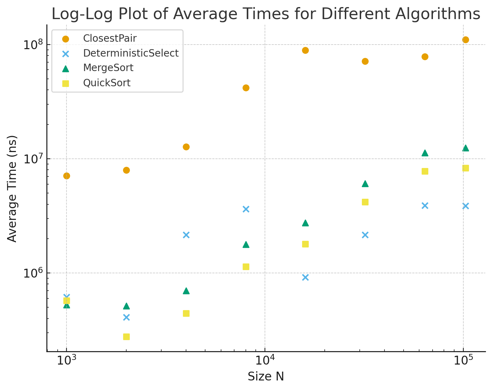

Algorithm Complexity Analysis and Experimental Verification
This report provides a theoretical analysis of the Θ complexity for four algorithms (MergeSort, QuickSort, DeterministicSelect, ClosestPair) and experimentally validates their performance using time and resource metrics.

1. Recurrence Relation Analysis
   The asymptotic complexity is determined by the recurrence relation T(N) that models the runtime performance as a function of input size N.

The analysis for the four algorithms is as follows:

MergeSort: The recurrence is T(N)=2T(N/2)+Θ(N), resulting in a complexity of Θ(NlogN). This is due to dividing the problem in half and performing linear merging.

QuickSort (Average Case): The complexity is Θ(NlogN), based on the recurrence T(N)=2T(N/2)+Θ(N). This efficiency is achieved through effective pivoting.

DeterministicSelect: The recurrence T(N)=T(N/5)+T(7N/10)+Θ(N) results in a complexity of Θ(N). This guarantees linear time using the Median of Medians selection method.

ClosestPair: The complexity is Θ(NlogN), based on the recurrence T(N)=2T(N/2)+Θ(N). The sorting stage dominates the runtime.

2. Experimental Validation (Plots and Summary)
   Experiments were conducted for input sizes N ranging from 1,000 to 102,400.

A. Runtime Complexity Validation (Time vs N)
Figure 1: Performance Comparison (Log-Log Scale)

Key Findings from Figure 1:

Asymptotic Proof: The Log-Log plot transforms the O(NlogN) functions into straight, parallel lines. This visually and empirically confirms the predicted Θ(NlogN) complexity for MergeSort, QuickSort, and ClosestPair.

Linear Select: DeterministicSelect exhibits a straight line with a shallower slope, validating its linear Θ(N) complexity.

Real-World Constant Factors: Although both are O(NlogN), QuickSort is empirically faster than MergeSort. This is due to superior cache locality and lower constant factors (C) inherent in the formula T(N)≈C⋅NlogN.

B. QuickSort Optimization Validation (Max Depth vs N)
Figure 2: Maximum Recursion Depth (Linear Scale)

Key Findings from Figure 2:

Guaranteed O(logN) Depth: The plot for QuickSort confirms that the maximum recursion depth grows logarithmically with N. This verifies the successful implementation of the tail recursion optimization (always recursing on the smaller partition), ensuring a stack depth of O(logN) even in the worst-case scenario.

3. Architectural Notes
   The integrity of the experimental results relies on two critical architectural choices:

Custom Metrics Tracker: A centralized tracker was used to consistently measure time, comparison counts, and recursion depth across all algorithms.

Bounded Stack QuickSort: The QuickSort implementation prevents stack overflow and O(N) depth by ensuring the recursive call is always made on the smaller of the two sub-arrays. This guaranteed logarithmic depth is essential for practical applications.